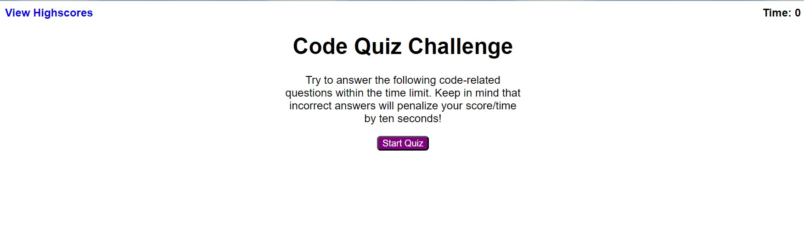
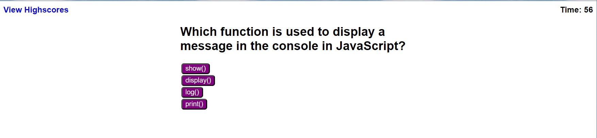
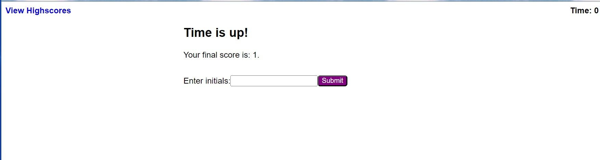
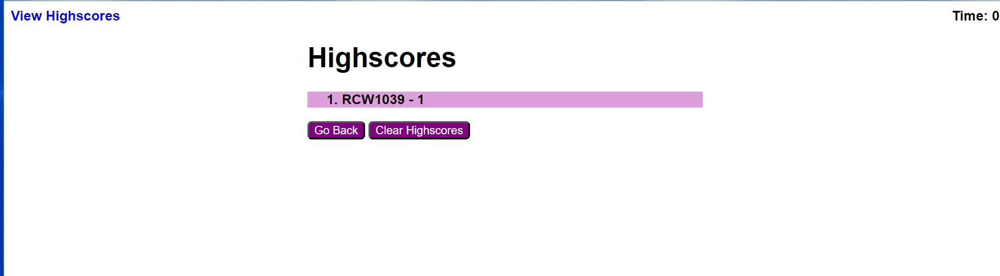

# JavaScriptCodeQuiz

## Description

This website allows a user to take a timed quiz on JavaScript fundamentals that scores high
scores so that the user can gauge their progress compared to their peers.

This was accomplished by:

-setting up a quiz that is initiated by clicking a start button
-when the button is clicked, a timer starts and the user is presented with a question
-when the questions is answered the user is presented with another question
-when the questions is answered incorrectly 10 seconds is deducted from the clock
-when all questions are answered or the timer reaches 0, the game is over
-when the game is over the user can enter their initials
-their score and initials entered are maintained in a highscore list until the user clears the scores

## Usage

The deployed website can be found in the following location:

https://robertwright0830.github.io/JavaScriptCodeQuiz/

